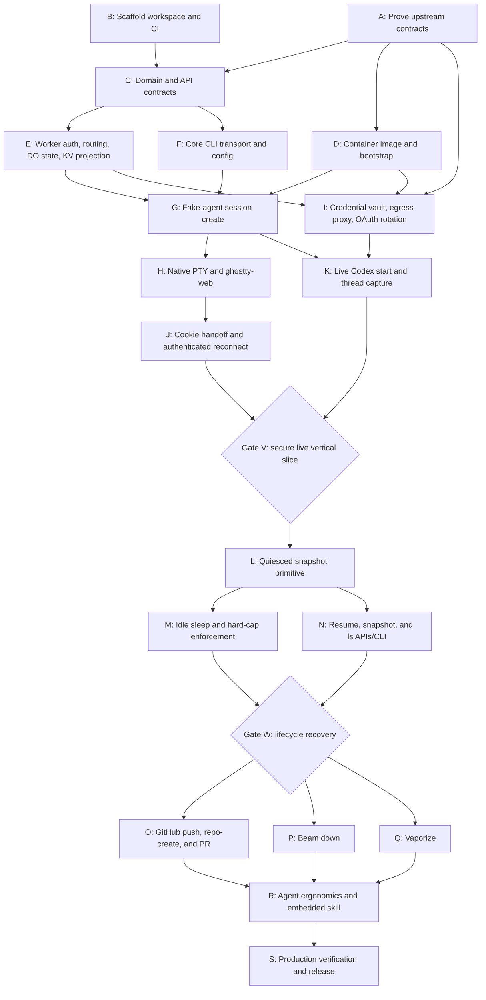

# Scotty implementation DAG

This is the execution plan for `PLAN.md`. Build one secure vertical slice first, then add lifecycle and shipping behavior behind explicit gates. The critical design choice is that each session's Sandbox Durable Object owns lifecycle state and credentials; KV is only the eventually consistent list projection.

## Implementation corrections

These normalize `PLAN.md` against the current Sandbox SDK contracts before code is written:

1. Use `/workspace/<session-id>` rather than `/work/<session-id>`. `createBackup()` only accepts directories under `/workspace`, `/home`, `/tmp`, `/var/tmp`, or `/app`.
2. Set `CODEX_HOME=/workspace/<session-id>/.codex`. One backup then contains both the worktree and rollout files; it contains only sentinel auth data.
3. Override `onActivityExpired()` to quiesce, back up, and stop. `onStop()` runs after shutdown and is cleanup-only.
4. Use `Container.schedule()` for the hard-cap callback; do not replace the SDK's lifecycle `alarm()` implementation.
5. Keep `SCOTTY_TOKEN` as the CLI/bootstrap recovery credential. Browser authority lives in the singleton Auth DO; do not persist browser credentials or a per-session `webToken` in KV.
6. The Cloudflare Codex example proves sentinel injection, but not rotated ChatGPT OAuth persistence. Token refresh and DO persistence need a contract test before real credentials are used.
7. Build the terminal/create path with a fake agent first. The real Codex end-to-end gate depends on credential isolation, reversing the unsafe implication of Phase 1 preceding Phase 1.5.

## State ownership and invariants

### Authoritative state

- **Sandbox DO storage:** authoritative `SessionRecord`, active operation lease, real Codex credential bundle, hard-cap schedule metadata.
- **KV:** list/read projection only. It may lag; it must never authorize a transition.
- **R2:** immutable backup objects. The DO stores the active and previous backup handles.
- **Container filesystem:** disposable working state. `/workspace/<id>` is recovered from R2.
- **Worker secrets:** initial `CODEX_AUTH_JSON`, `GH_TOKEN`, and `SCOTTY_TOKEN`. An existing DO credential bundle is never overwritten from the seed. Browser pairing grants, client digests, and PTY ticket digests live only in the retained singleton Auth DO.

```ts
type SessionStatus = "booting" | "warm" | "sleeping" | "failed" | "gone";

type SessionOperation = {
  kind: "create" | "snapshot" | "resume" | "pr" | "down" | "vaporize";
  nonce: string;
  startedAt: string;
} | null;

interface SessionRecord {
  version: 1;
  id: string;
  status: SessionStatus;
  operation: SessionOperation;
  repo: string;
  defaultBranch: string;
  branch: string;
  createdAt: string;
  updatedAt: string;
  hardCapAt: string;
  backup?: { current: DirectoryBackup; previous?: DirectoryBackup };
  codexThreadId?: string;
  failure?: { code: string; message: string; recoverable: boolean };
}
```

### Invariants

- Every mutating command executes inside the session's Sandbox DO and acquires the persisted operation lease.
- Status preconditions are checked against DO storage, never KV.
- Real credentials never enter container env, files, command arguments, logs, KV, responses, or backups.
- `sleeping` is published only after a new backup handle is durable. At hard-cap failure, retain the last good handle, record `failed`, and destroy to preserve the spend bound.
- A new backup becomes `current` only after upload succeeds. Delete `previous` only after the state update commits.
- Snapshot and shutdown pause the tmux agent process group, `sync`, create the backup, then resume or destroy it.
- `vaporize` is terminal: destroy runtime, delete all known backup prefixes and the DO credential bundle, remove the KV projection, then persist a minimal `gone` tombstone.

## Lifecycle graph

```mermaid
stateDiagram-v2
    [*] --> booting: create
    booting --> warm: worktree + tmux + agent ready
    booting --> failed: setup fails

    warm --> warm: snapshot / pr / down
    warm --> sleeping: idle or hard-cap checkpoint succeeds
    warm --> failed: hard-cap checkpoint fails; runtime destroyed

    sleeping --> booting: resume
    failed --> booting: resume from last good backup
    booting --> warm: restore + codex resume succeeds

    booting --> gone: vaporize
    warm --> gone: vaporize
    sleeping --> gone: vaporize
    failed --> gone: vaporize
    gone --> [*]
```



`operation` serializes transient work without expanding the public status vocabulary. A conflicting command returns exit/API code `wrong_state`; retries with the same nonce return the prior result when available.

## Delivery DAG



**Critical path:** `A → C → E/D → G → H/I → J/K → V → L → M/N → W → O/P/Q → R → S`.

Expected effort: **10–15 focused engineering days**, plus Cloudflare deployment/account setup. `A` can materially change the estimate if OAuth refresh cannot be implemented through the current interception contract.

## Work packages

### Wave 0 — prove and scaffold

#### A. Prove upstream contracts — 1–2 days

- **Depends on:** none.
- **Deliver:** pinned Sandbox SDK/container pair; executable probes for custom Sandbox DO RPC/storage, `OutboundHandlerContext.containerId`, `onActivityExpired()`, `schedule()`, backup/restore of `/workspace/<id>`, named-session terminal attachment, raw PTY framing, and Codex OAuth refresh.
- **Files:** `spikes/`, decision notes in this file or `PLAN.md`, pinned versions in package manifests.
- **Proof:** deployed test Worker demonstrates each contract. No real long-lived credential is enabled until sentinel replacement and rotation persistence pass.
- **Risk:** the upstream Codex sample injects an access token but does not implement refresh persistence; this is new integration work.

#### B. Scaffold workspace and CI — 0.5 day

- **Depends on:** none.
- **Deliver:** root workspace, `worker/`, `cli/`, TypeScript strict mode, formatting, unit/integration scripts, Wrangler config, generated binding types.
- **Files:** `package.json`, `tsconfig.json`, `worker/package.json`, `worker/wrangler.jsonc`, `worker/src/index.ts`, `cli/scotty.ts`.
- **Proof:** install, typecheck, unit tests, and a no-secret local Worker boot pass.

#### C. Domain and API contracts — 1 day

- **Depends on:** A, B.
- **Deliver:** parsed request types, `SessionRecord`, transition guards, error codes, stable JSON response shapes, and state projection shape including `ageSeconds` and `capRemainingSeconds`.
- **Files:** `worker/src/contracts.ts`, `worker/src/session.ts`, `worker/test/session-state.test.ts`.
- **Proof:** table-driven tests cover every allowed/denied transition, stale KV, duplicate nonce, and malformed boundary input.

### Wave 1 — credential-free vertical infrastructure

#### D. Container image and bootstrap — 1 day

- **Depends on:** A, B.
- **Deliver:** pinned Ubuntu/Sandbox base, Codex `0.144.x`, tmux/git/gh, bare Rift clone, UTF-8/TERM setup, noninteractive Git, `/workspace/<id>` conventions.
- **Files:** `worker/container/Dockerfile`, optional `worker/container/bootstrap.sh`.
- **Proof:** image smoke test verifies versions, bare-clone fetch, worktree creation from dynamically resolved default branch, and absence of credentials.

#### E. Worker auth, routing, DO state, and KV projection — 1 day

- **Depends on:** C.
- **Deliver:** Hono route shell, bearer/cookie auth boundary, typed Sandbox DO methods, operation lease, DO-to-KV projection, redacted structured errors.
- **Files:** `worker/src/index.ts`, `worker/src/session.ts`, `worker/src/auth.ts`.
- **Proof:** route tests cover 401/404/405, wrong state, concurrent mutation, stale projection, and secret redaction.

#### F. Core CLI transport and config — 0.5–1 day

- **Depends on:** C.
- **Deliver:** `init`, `up`, `ls`, `attach`; host/token precedence; stable error decoding; TTY versus piped JSON selection.
- **Files:** `cli/scotty.ts`, `cli/test/cli.test.ts`.
- **Proof:** fixture HTTP server verifies config/env/flag precedence, JSON envelopes, stderr, and exit codes 0–5.

#### G. Fake-agent session create — 1 day

- **Depends on:** D, E, F.
- **Deliver:** `POST /api/sessions`, ID allocation, booting/warm persistence, latest-default-branch worktree, tmux session, hard-cap schedule. Run a harmless fake agent command instead of Codex.
- **Files/symbols:** `ScottySandbox.createScottySession`, `prepareWorktree`, `startAgentTmux`.
- **Proof:** `scotty up --detach` creates a warm session whose tmux process and worktree survive HTTP disconnects.

#### H. Native PTY and ghostty-web — 1 day

- **Depends on:** G.
- **Deliver:** authenticated PTY upgrade routed to the named execution session attaching `tmux attach -t agent`; bundled ghostty-web/WASM; resize, binary output-before-ready, reconnect backoff.
- **Files:** `worker/public/terminal.html`, asset build step, `worker/src/index.ts` PTY route.
- **Proof:** browser test types into tmux, resizes, disconnects, and reconnects without replacing the process.

### Wave 2 — credential safety and live Codex

#### I. Credential vault, egress proxy, and OAuth rotation — 2 days

- **Depends on:** A, D, E.
- **Deliver:** DO-stored credential bundle seeded once; session-bound sentinel; `enableInternet=false`, `interceptHttps=true`, explicit `allowedHosts`; host-specific OpenAI/GitHub injection; deny-all fallback; OAuth refresh adapter that atomically persists rotations.
- **Files:** `worker/src/egress.ts`, custom `Sandbox` and `ContainerProxy` exports, security integration tests.
- **Proof:** inside-container `env`, auth file, process list, Git config, snapshots, logs, and API responses contain only sentinels; blocked HTTP/HTTPS/raw TCP fail; forced refresh changes the DO bundle and survives restart.
- **Risk:** validate redirects so injected headers never cross to a non-allowlisted host.

#### J. Registered-browser handoff and authenticated reconnect — 0.5 day

- **Depends on:** H.
- **Deliver:** compatibility root-token requests atomically upgrade to an administrator browser credential; `/devices` issues five-minute one-use fragment pairing links; target browsers get independent 30-day Secure HttpOnly SameSite cookies; PTY upgrades consume five-minute tickets bound to the browser and session.
- **Files:** `worker/src/auth-registry.ts`, `worker/src/auth-object.ts`, `worker/src/auth.ts`, `worker/src/index.ts`, `worker/public/pair.html`, `worker/public/devices.html`, `worker/public/terminal.html`.
- **Proof:** the Auth DO persists digests only; concurrent pairing/ticket consume has exactly one winner; browser history and ordinary session URLs contain no root token; revoked clients fail HTTP immediately and active PTYs within the lease bound; unauthenticated page and WebSocket access fail.

#### K. Live Codex start and thread capture — 0.5–1 day

- **Depends on:** G, I.
- **Deliver:** sentinel auth file, `CODEX_HOME`, interactive Codex in tmux, safely quoted initial prompt, rollout discovery, stored thread UUID.
- **Files/symbols:** `seedSentinelAuth`, `startCodex`, `discoverCodexThread`.
- **Proof:** a real Codex turn completes through the proxy; the container never observes the real credential; refreshing the browser reattaches to the same TUI and thread.

**Gate V — secure live vertical slice:** `scotty up "hello"` opens a working terminal on latest `dev`, real credentials remain outside the container, and reconnect preserves tmux.

### Wave 3 — lifecycle and recovery

#### L. Quiesced snapshot primitive — 1 day

- **Depends on:** Gate V.
- **Deliver:** pause tmux child process group, flush filesystem, `createBackup({dir: sessionRoot})`, atomically rotate backup handles, resume the agent, and garbage-collect superseded R2 prefixes.
- **Files/symbols:** `ScottySandbox.checkpoint`, `withQuiescedAgent`, `deleteBackupPrefix`.
- **Proof:** repeated and concurrent snapshots serialize; failure retains the previous good handle and resumes the agent; restored Git and rollout files match the checkpoint.

#### M. Idle sleep and hard-cap enforcement — 1 day

- **Depends on:** L.
- **Deliver:** `onActivityExpired()` checkpoint-before-stop; `schedule(hardCapAt, 'enforceHardCap')`; bounded hard-cap retries; DO/KV status publication after outcome.
- **Files/symbols:** `ScottySandbox.onActivityExpired`, `enforceHardCap`.
- **Proof:** forced idle resumes from the same branch/thread; an open PTY cannot bypass hard cap; hard-cap backup failure destroys runtime while retaining the last known recovery handle and a visible failure state.

#### N. Resume, snapshot, and ls APIs/CLI — 1 day

- **Depends on:** L.
- **Deliver:** explicit snapshot, restore, tmux recreation, `codex resume <uuid>` with `--last` fallback, cap reset, list freshness fields, wrong-state errors.
- **Files:** `worker/src/index.ts`, `worker/src/session.ts`, `cli/scotty.ts`.
- **Proof:** sleeping and failed/recoverable sessions restore; warm resume exits 5; missing/expired backup errors are actionable.

**Gate W — lifecycle recovery:** idle and hard-cap paths produce a restorable backup; resume recovers both worktree and Codex thread.

### Wave 4 — shipping, teardown, and release

#### O. GitHub push, repo-create, and PR — 1 day

- **Depends on:** Gate W, I.
- **Deliver:** sentinel GitHub credential helper, dynamic default branch, existing-repo push/PR, missing-repo private create/push, stable URLs.
- **Files/symbols:** `ScottySandbox.publish`, `POST /api/sessions/:id/pr`, CLI `pr`.
- **Proof:** Rift PR targets `dev`; a new repo is created and pushed without attempting an invalid PR; no remote URL or logs contain tokens.

#### P. Beam down — 1 day

- **Depends on:** Gate W.
- **Deliver:** streamed tar containing metadata and newest rollout, branch fetch, 0600 local rollout write, exact resume command; branch-only fallback when rollout parsing fails.
- **Files/symbols:** `GET /api/sessions/:id/down`, CLI `down`.
- **Proof:** local `codex resume <uuid> -C <path>` finds the conversation; malformed/missing rollout still returns branch metadata and a nonfatal warning.

#### Q. Vaporize — 0.5–1 day

- **Depends on:** Gate W.
- **Deliver:** idempotent destructive transition, runtime destroy, R2 prefix deletion for all known handles, credential deletion, KV removal, gone tombstone; CLI confirmation/`--yes` behavior.
- **Files/symbols:** `ScottySandbox.vaporize`, `DELETE /api/sessions/:id`, CLI `vaporize`.
- **Proof:** repeated calls are safe; no runtime, R2 object, credential bundle, or KV projection remains.

#### R. Agent ergonomics and embedded skill — 1 day

- **Depends on:** O, P, Q.
- **Deliver:** all commands/flags, `--json` and non-TTY JSON, stable exit codes, terse help, `help --agents`, embedded `SKILL.md`, all install targets.
- **Files:** `cli/scotty.ts`, CLI golden tests.
- **Proof:** a clean agent given only `scotty skills` completes `up → pr → vaporize` unattended; every piped command parses as JSON.

#### S. Production verification and release — 1 day

- **Depends on:** R.
- **Deliver:** deployment runbook, R2 lifecycle rule, secret setup, observability/redaction checks, cost-bound smoke test, compiled Bun CLI artifact, README.
- **Files:** `README.md`, release scripts/configuration.
- **Proof:** full deployed acceptance suite passes against `workers.dev`; logs contain session IDs and operation outcomes but no prompts, source, URLs with tokens, or credentials.

## Boundary map

| Boundary        | Caller → owner                        | Contract                                                | Failure behavior                          | Proof point          |
| --------------- | ------------------------------------- | ------------------------------------------------------- | ----------------------------------------- | -------------------- |
| HTTP API        | CLI/browser → Worker                  | Parsed requests; bearer/cookie auth; stable JSON errors | Reject before DO access                   | Route tests          |
| Session command | Worker → Sandbox DO                   | Typed intent + nonce                                    | Transition guard and serialized operation | DO state tests       |
| Runtime         | Sandbox DO → container                | Explicit cwd/env/session; no shell interpolation        | Record failure; keep prior backup         | Deployed integration |
| Egress          | container → ContainerProxy → upstream | Host allowlist + sentinel-bound injection               | 403/520 deny; no redirect leakage         | Security suite       |
| Projection      | Sandbox DO → KV                       | Versioned non-secret session summary                    | Retry; reads may declare staleness        | Projection tests     |
| Backup          | Sandbox DO → R2                       | Immutable `DirectoryBackup` under session root          | Keep prior current handle                 | Restore tests        |
| Terminal        | browser → Worker → named PTY          | Authenticated WS; binary + control frames               | Reconnect to same tmux                    | Browser test         |
| Beam down       | Worker → CLI filesystem               | Tar + metadata; local mode 0600                         | Branch-only fallback                      | Local integration    |

## Verification matrix

| Gate            | Unit/local                           | Deployed Cloudflare                | Destructive/credential check             |
| --------------- | ------------------------------------ | ---------------------------------- | ---------------------------------------- |
| Contracts       | Type probes and fixtures             | Sandbox/PTY/backup probe           | Disposable credentials only              |
| Secure vertical | State/routes/CLI tests               | Real Codex turn + reconnect        | Files/env/log/R2 scan; deny egress       |
| Lifecycle       | Transition and fault-injection tests | Idle, hard cap, restore            | Backup-failure and stale-handle recovery |
| Ship            | Git/gh command fixtures              | Existing and new private test repo | PAT scope and token-leak scan            |
| Down/vaporize   | Tar/path/mode tests                  | Resume locally; inspect R2/KV/DO   | Repeated teardown                        |
| Release         | Golden help/JSON tests               | End-to-end unattended workflow     | Cost cap and log redaction               |

## Rollout

1. Deploy a development Worker with a dedicated R2 bucket, KV namespace, test PAT, and short backup TTL.
2. Pass Contract Gate A and Security Gate V using a disposable repository and credential bundle.
3. Pass lifecycle fault injection with 2-minute idle and 5-minute hard cap; then restore production defaults of 60 minutes and 4 hours.
4. Run one canary session through `up → snapshot → resume → pr → down → vaporize` and inspect all storage/log surfaces.
5. Publish the compiled CLI and embedded skill only after the canary leaves no secret or orphaned resource.

## Residual risks and open gates

- **OAuth protocol drift:** Codex refresh/rollout formats are pinned-version internals. Gate A must freeze fixtures and fail closed on unknown shapes.
- **Unexpected host loss:** `onActivityExpired()` covers managed idle, not infrastructure loss. Recovery is only as fresh as the latest successful manual/periodic/hard-cap checkpoint. Decide checkpoint cadence after measuring backup duration and R2 cost; this does not block the vertical slice.
- **Backup consistency:** pausing the agent reduces write races but cannot make external GitHub operations transactional. PR/down commands must run under the same operation lease.
- **KV freshness:** `ls` is a projection. Include `projectedAt`; direct commands always consult the DO.
- **Allowed registries:** every allowed host remains an exfiltration channel for prompts/source, even without credentials. Start with the smallest host set needed by Rift and make additions explicit configuration changes.
