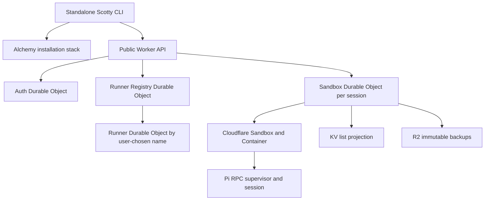

# Scotty implementation DAG

This file records state ownership, lifecycle invariants, and delivery gates. Public behavior and
security constraints come from `PLAN.md`; Effect and Alchemy implementation constraints come from
`EFFECT_V4_MIGRATION.md`.

## Ownership graph


```mermaid
flowchart TD
    CLI["Standalone Scotty CLI"] --> AL["Alchemy installation stack"]
    CLI --> API["Public Worker API"]
    API --> AUTH["Auth Durable Object"]
    API --> SESSION["Sandbox Durable Object per session"]
    API --> REGISTRY["Runner Registry Durable Object"]
    REGISTRY --> RUNNER["Runner Durable Object by user-chosen name"]
    SESSION --> CF["Cloudflare Sandbox and Container"]
    SESSION --> KV["KV list projection"]
    SESSION --> R2["R2 immutable backups"]
    CF --> PI["Pi RPC supervisor and session"]
```

The Session Durable Object is authoritative. KV and UI rows are projections. R2 backups are
immutable artifacts referenced by Session authority. Runner registry state is distinct from runner
connection state and runtime state.

## Session lifecycle

```text
absent
  -> booting
  -> warm
  -> sleeping
  -> warm
  -> failed
  -> gone
```

Only one operation lease may mutate a session. Create schedules the hard cap before committing its
initial authoritative record. Snapshot and managed sleep quiesce and stop the Pi session before sync and
backup. Resume requires a committed current backup. Vaporize is forward-only and retryable until
all owned resources are absent.

A failed or interrupted operation must either retain a recoverable lease with a scheduled
reconciler, or publish a typed runtime failure. It must never report success from ambiguous
provider state.

## Credential path

```text
local Pi auth -> Cloudflare secret upload -> Session credential authority
             -> container sentinel -> allowlisted egress substitution -> upstream
```

Real credentials cannot cross into the container, KV, R2, logs, URLs, process arguments, API
responses, or Alchemy state. Every storage, egress, backup, OAuth, and container adapter satisfies
shared contract tests.

## Installation lifecycle

```text
required name + selected Cloudflare profile
  -> derive namespaced logical and physical resource names
  -> create or adopt Alchemy stack
  -> deploy resources
  -> generate or rotate root secret outside Alchemy state
  -> write mode-0600 local pointer
  -> doctor live metadata and authentication
```

Moving machines repeats the recovery path with `--existing`; copying local config is optional.
Repository state contains no account identity or deployed resource identifiers.

## Runner lifecycle

```text
register name -> issue one-time credential -> install user service
  -> outbound authenticated link -> accepting or draining
  -> disable -> disconnect -> remove when assigned session count is zero
```

Runner registration and host setup are shipped. Runner-backed session creation is a closed gate
until a native Pi RPC transport has lifecycle, reconnect, checkpoint, credential, and deployed
acceptance proof. No compatibility application or committed executable fills that gap.

## Delivery gates

1. Static gate: format, skill lint, lint, typecheck, secret scan, and clean generated artifacts.
2. Contract gate: worker, CLI, protocol, Effect, and offline end-to-end suites.
3. Packaging gate: standalone CLI build plus container image build with all Pi extensions listed.
4. Git gate: logical commits, clean tree, pushed branch, and reviewable draft PR.
5. Cloud gate: guarded Alchemy production deployment and settled Container rollout.
6. Canary gate: create, authenticated Pi worklog, snapshot, resume, beam down, and vaporize with no
   orphaned runtime, backup, credential, or projection state.

A later gate cannot waive an earlier one. A local fake proves contracts, not live provider
readiness.
