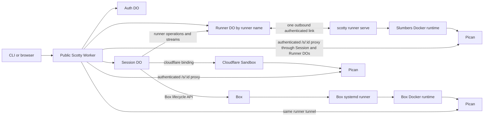
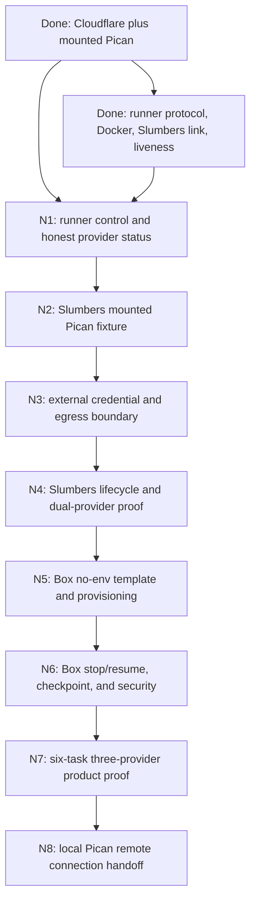

# Scotty portable execution — active plan

This is the governing plan for portable execution after commit
`9499e4d649c559e3dc50a85709a240471e822b99` on 2026-07-27. It records what is
implemented, the shape selected in the architecture work, the gaps discovered during the
Cloudflare and Slumbers deployment, and the vertical slices that take Scotty through Box.

This file supersedes the portable-execution delivery section in `IMPLEMENTATION_DAG.md`.
`PLAN.md`, `IMPLEMENTATION_DAG.md`, and `EFFECT_V4_MIGRATION.md` still govern their existing
security, state-authority, lifecycle, Effect, Alchemy, and deployment invariants.

Scotty is a new product. The remaining portability work may hard-cut internal schemas and routes.
Do not add compatibility branches for unused pre-portability records, legacy PTYs, Sheppard, or
old provider names.

## Outcome

One session is one durable task. The user chooses where it starts, then always works through the
same Scotty URL and the same mounted Pican application:

```sh
scotty beam up "PROMPT" --repo owner/repo --provider cloudflare
scotty beam up "PROMPT" --repo owner/repo --provider runner --runner slumbers
scotty beam up "PROMPT" --repo owner/repo --provider box
```

The prompt remains a normal CLI argument and JSON request field. A prompt file is not required.

The session ID, repository, branch, Pican identity, transcript, and lifecycle remain stable while
provider resource IDs and process IDs stay internal. A session never silently falls back to
another provider and does not migrate between providers in this plan.

## Requirements

| ID  | Requirement                                                                                                                                                                | Status    |
| --- | -------------------------------------------------------------------------------------------------------------------------------------------------------------------------- | --------- |
| R0  | A user can create, open, steer, stop, resume, and destroy the same kind of Scotty session on Cloudflare, a named runner, or Box.                                           | Core goal |
| R1  | Pican is the only session UI and agent host; Scotty does not rebuild a terminal or a second Codex app-server UI.                                                           | Must-have |
| R2  | The session Durable Object remains authoritative for session identity, lifecycle, operation leases, execution binding, credentials, and committed checkpoints.             | Must-have |
| R3  | Provider selection is explicit and immutable per session; an unavailable provider fails visibly without automatic fallback.                                                | Must-have |
| R4  | Real Codex, GitHub, Box, Cloudflare, and runner credentials never enter an untrusted workload, prompt, URL, process argument, log, KV record, R2 archive, or API response. | Must-have |
| R5  | Desired provider/runner state, observed connection state, runtime state, and displayed UI state are distinct and have one owner each.                                      | Must-have |
| R6  | Slumbers and manually managed Linux/VPS machines share one outbound runner path with per-session Docker isolation.                                                         | Must-have |
| R7  | Box uses one no-env Box per session, created from a stopped template and restored with the same Box ID.                                                                    | Must-have |
| R8  | Every delivery step is a small, demoable vertical slice with local, adapter-contract, live failure, cleanup, and credential-negative proof.                                | Must-have |

## Locked language

| Term              | Meaning                                                                                          | Do not call it                      |
| ----------------- | ------------------------------------------------------------------------------------------------ | ----------------------------------- |
| Session           | Durable user task with one workspace, lifecycle, Pican identity, and immutable provider binding. | sandbox, box, environment           |
| Provider          | A compute implementation selected at session creation: `cloudflare`, `runner`, or `box`.         | location, execution target, backend |
| Runner            | The Scotty service running on a user-controlled Linux machine. `slumbers` is a runner name.      | host daemon, machine enrollment     |
| Connection        | A Pican client’s saved relationship to a remote Pican server.                                    | provider, runner                    |
| Control plane     | The public Worker plus the authoritative Auth, Session, and Runner Durable Objects.              | host, provider                      |
| Runtime           | The provider resource containing the workspace, Pican, Codex, and Git processes.                 | control plane                       |
| Execution binding | The immutable provider-specific identity stored on a session.                                    | location field                      |

There is no `scotty-host` executable and no Beam Durable Object. The executable is `scotty`; the
machine command is `scotty runner serve`; the Durable Objects are named for what they own:
`ScottySandbox`, `ScottyAuthRegistry`, and `ScottyRunner`.

## What is implemented

### D0 — Cloudflare session product

The original product already supplied:

- one authoritative Session Durable Object per session;
- Auth Durable Object ownership, pairing, transfer, revocation, and recovery;
- KV as a non-secret session-list projection;
- R2 current/previous immutable checkpoint generations;
- session-bound Codex and GitHub sentinels with real credentials held by Worker secrets and
  session Durable Object storage;
- default-deny Cloudflare Sandbox egress with real credential substitution only at allowed
  upstreams;
- create, snapshot, hard-cap sleep, resume, beam down, and vaporize;
- guarded Alchemy production deployment plus fake and deployed E2E harnesses.

### D1 — Pican-hosted Cloudflare vertical

Commit `bb27c5f33d087093a86f8db724db29e5e57c603c` replaced the legacy
Sheppard/native-PTY/ghostty-web runtime with Pican.

The embedded Linux binary is pinned to Pican commit
`e2b185bcdef8eaba9e5dc0ff9c5ad1121dac2979` and verified by
`worker/container/pican-linux-amd64.lock.json`.

The shipped Cloudflare path now:

1. prepares `/workspace/<session-id>`;
2. launches one private Pican process;
3. mounts all Pican assets, API calls, and SSE below `/s/<session-id>`;
4. authenticates the browser at Scotty;
5. strips browser and spoofed Pican credentials;
6. injects one session-owned Pican proxy token on the private hop;
7. creates the Pican/Codex session idempotently with the outer Scotty ID;
8. persists Pican’s returned native identity;
9. sends Pican `SIGTERM`, waits, and runs `sync` before checkpoint or stop;
10. restores the workspace and the same Pican identity on resume.

There is no legacy terminal fallback.

### D2 — Portable runner command protocol

Commit `cf09a5798dc9ba09abe5b08356b3eed0012dfba6` added
`scotty runner serve`.

The current typed protocol supports:

- `EnsureRuntime`;
- `InspectRuntime`;
- one-shot `ExecRuntime` with argv rather than shell text;
- `StopRuntime`;
- `RemoveRuntime`;
- stable session-to-workspace/resource identity;
- same-session serialization and cross-session concurrency;
- bounded output;
- exact child-environment allowlisting;
- workspace-relative, symlink-aware cwd containment;
- operation IDs and durable runner receipts.

### D3 — Slumbers control-plane connection

Commit `ad827cc252a4d28e782daac305d450b1f51325c6` added:

- a private, URL-disabled Cloudflare Worker containing `ScottyRunner`;
- an authenticated outbound WebSocket from `scotty runner serve`;
- a Docker execution implementation with digest-pinned images, no Docker socket in the workload,
  no host networking, dropped Linux capabilities, resource limits, and bind-mounted
  session workspace;
- a durable operation journal with ambiguous-exec recovery fencing;
- the first status display in the sessions page.

The extra private Worker is a Cloudflare deployment boundary for the Runner Durable Object. It is
not another control plane or a user-visible provider. The public Worker still owns authentication
and routes; it reaches the Runner Durable Object through the `RUNNERS` service binding.

### D4 — Honest runner liveness and forward-only browser auth

Commits `b9bb1ae92a4d80a4234d2d92c2c856ce51cae21d` and
`9499e4d649c559e3dc50a85709a240471e822b99` added:

- a correlated one-second Runner probe/ack rather than treating an attached socket as healthy;
- socket closure on send failure, probe timeout, protocol mismatch, or replacement;
- a forward-only Auth authority reset without legacy migration branches;
- clean owner recovery on the new authority.

Production and Slumbers were then deployed from exact commit `9499e4d`. Slumbers runs the current
Linux binary as an enabled user systemd service with Docker isolation. The live sessions page
proved `Cloudflare available` and `Slumbers connected`.

That proof means only that Cloudflare was deployed and the Slumbers control link answered a live
probe. It does **not** mean a Scotty session can run on Slumbers.

## Current gaps

1. `ProviderSchema` still accepts only `"cloudflare"`, and `SessionRecord` has no portable
   execution binding.
2. Session orchestration still calls the Cloudflare Sandbox directly. Runner operations are not
   used by create, Pican proxying, checkpoint, resume, or vaporize.
3. `Cloudflare available` is hardcoded. Runner connection is actively probed, but there is no
   control-plane-owned desired state, drain command, disconnect command, reconnect supervisor, or
   runner management UI.
4. The runner protocol carries finite request/reply operations only. It cannot yet carry Pican’s
   streaming HTTP/SSE traffic or large checkpoint streams.
5. The current Slumbers image is an execution proof image, not the portable Pican/Codex runtime.
6. External-workload egress cannot yet redeem session sentinels without allowing bypass. Do not
   put real Codex or GitHub credentials on Slumbers or Box until that gate passes.
7. There is no Box API adapter, stopped template, no-env fork, Box lifecycle mapping, or Box
   canary.
8. The creation UI cannot select a provider or runner. It cannot show task state separately from
   provider, runner-connection, and runtime state.
9. Local Pican cannot yet save a Scotty remote connection and load its remote sessions. The
   mounted browser Pican is the current interaction path.

## A: Cloudflare authority with Pican runtimes and an outbound runner tunnel



The control plane owns the logical session. Providers supply compute. Pican owns the agent-facing
application and native agent protocol. The runner is a transport and isolation executor, not a
second scheduler.

### Fit check: R × A

| Req | Requirement                                                                                                                                                                | Status    |  A  |
| --- | -------------------------------------------------------------------------------------------------------------------------------------------------------------------------- | --------- | :-: |
| R0  | A user can create, open, steer, stop, resume, and destroy the same kind of Scotty session on Cloudflare, a named runner, or Box.                                           | Core goal | ✅  |
| R1  | Pican is the only session UI and agent host; Scotty does not rebuild a terminal or a second Codex app-server UI.                                                           | Must-have | ✅  |
| R2  | The session Durable Object remains authoritative for session identity, lifecycle, operation leases, execution binding, credentials, and committed checkpoints.             | Must-have | ✅  |
| R3  | Provider selection is explicit and immutable per session; an unavailable provider fails visibly without automatic fallback.                                                | Must-have | ✅  |
| R4  | Real Codex, GitHub, Box, Cloudflare, and runner credentials never enter an untrusted workload, prompt, URL, process argument, log, KV record, R2 archive, or API response. | Must-have | ✅  |
| R5  | Desired provider/runner state, observed connection state, runtime state, and displayed UI state are distinct and have one owner each.                                      | Must-have | ✅  |
| R6  | Slumbers and manually managed Linux/VPS machines share one outbound runner path with per-session Docker isolation.                                                         | Must-have | ✅  |
| R7  | Box uses one no-env Box per session, created from a stopped template and restored with the same Box ID.                                                                    | Must-have | ✅  |
| R8  | Every delivery step is a small, demoable vertical slice with local, adapter-contract, live failure, cleanup, and credential-negative proof.                                | Must-have | ✅  |

### Execution intent and binding

The Session Durable Object must record intent before the first external side effect. Hard-cut
`SessionRecord` to a new schema version when the runner session slice lands:

```ts
type Execution =
  | {
      readonly state: "provisioning";
      readonly provider: "cloudflare";
      readonly sandboxId: string;
    }
  | {
      readonly state: "provisioning";
      readonly provider: "runner";
      readonly runner: string;
      readonly runtimeId: string;
    }
  | {
      readonly state: "provisioning";
      readonly provider: "box";
      readonly templateId: string;
      readonly generation: number;
    }
  | {
      readonly state: "bound";
      readonly provider: "cloudflare";
      readonly sandboxId: string;
    }
  | {
      readonly state: "bound";
      readonly provider: "runner";
      readonly runner: string;
      readonly runtimeId: string;
    }
  | {
      readonly state: "bound";
      readonly provider: "box";
      readonly boxId: string;
      readonly runner: string;
      readonly runtimeId: string;
      readonly generation: number;
    };
```

The provisioning case is persisted with the operation lease before calling a provider. The bound
case is committed as soon as provider identity is known. The union is decoded at the storage
boundary. Do not use a stringly typed `location`, generic provider JSON bag, or optional fields
that allow impossible combinations.

The provider choice is written once and never changes. A bound provider resource identity is also
immutable unless its exact provider case defines a generation change during recovery. This plan
does not support moving a session between providers.

Box’s documented create/fork API does not expose an idempotency key, and the list response does
not expose per-Box environment tags. Never blindly repeat a timed-out Box provision request.
The Box systemd runner must include its neutral `BOX_ID`, Scotty session ID, and generation in its
authenticated hello so the Session Durable Object can complete a lost-response binding. If
neither the API response nor the runner callback establishes identity, keep the operation
`unknown` and reconcile the account before retrying.

### Small capability seams

Do not create a giant provider SDK or a generic `Runner` interface before the second real
implementation needs it. Keep these product capabilities explicit and extract their shared
Effect services one vertical at a time:

1. **Resource control** — provision/ensure, inspect, stop, resume, remove.
2. **Command execution** — argv, cwd, explicit environment, timeout, cancellation, bounded result.
3. **Mounted application stream** — authenticated HTTP request/response streaming for Pican,
   including SSE, disconnect cancellation, and bounded backpressure.
4. **Checkpoint stream** — quiesce Pican, export/import the workspace, then let the Session DO
   commit current/previous R2 generations.
5. **Credential broker** — validate a session/generation capability and redeem only a sentinel at
   an allowed upstream.

Git cloning, branch naming, credential-helper setup, Pican launch, Codex launch, Pican identity,
hard-cap policy, checkpoint-generation selection, and cleanup order are Scotty behavior. They do
not belong in provider adapters.

PTY is not a portability primitive in this plan. Pican’s HTTP/API/SSE application is the supported
interaction surface. A future terminal is a Pican feature or an independently authorized rescue
surface, not a reason to restore the deleted terminal stack.

## Ownership

### Scotty control plane

Scotty owns:

- browser and CLI authentication;
- session IDs, repository, branch, prompt, provider selection, and Pican identity;
- session lifecycle, operation leases, hard-cap schedules, and failure recovery;
- runner desired state and runner credential authority;
- real Codex/GitHub credentials and sentinel redemption;
- current/previous R2 checkpoint selection;
- the public `/s/<id>` route and all browser credential stripping;
- provider resource IDs and orphan reconciliation;
- the session list and provider/runner status read model.

### Pican

Pican owns:

- the Codex app-server process and protocol;
- the session transcript, projections, tasks, files, Git views, steering, and cancellation UI;
- runtime/native-session mapping inside the workspace;
- strict workspace/state-root containment;
- filtering child environments so Scotty’s Pican proxy credential never reaches Codex.

Scotty owns Pican’s process lifecycle around provider stop/checkpoint. Until Pican exposes a richer
quiesce contract, Scotty uses the proven `SIGTERM → bounded wait → sync → checkpoint` sequence.

### Provider

A provider owns only:

- resource creation and provider identity;
- low-level readiness and lifecycle calls it can guarantee;
- low-level command/file/stream transport;
- provider-specific timeout, death detection, and unsupported-capability failures;
- provider-native snapshots as a recovery accelerator;
- host-level isolation and network enforcement.

Provider status, snapshots, or heartbeats never override the authoritative Session record or R2
checkpoint decision.

### Provider-specific behavior

- **Cloudflare:** the Session Durable Object talks to its Sandbox directly. Cloudflare’s Container
  and backup primitives remain adapter details; Alchemy remains the only deployment owner.
- **Runner:** Slumbers or a manually managed Linux/VPS host runs one `scotty runner serve` systemd
  service and one isolated Docker runtime per session. Scotty can stop/remove session containers,
  but it does not power off the physical host.
- **Box:** the Worker uses the Box API to fork/resume/stop the Box. The Box starts the same runner
  through systemd; live commands and Pican traffic use the runner protocol, not provider-specific
  Box command APIs after bootstrap.
- **Future E2B, Daytona, exe.dev, Modal, or managed Hetzner:** add one concrete resource adapter,
  then use the same mounted-app/checkpoint contract where the provider can run the Scotty runner.
  Do not expand the common contract for speculative provider features.

A manually managed Hetzner VPS is a named `runner`, like Slumbers. A future Scotty-owned Hetzner
provisioner would be a separate provider.

## Runner connection and disconnection

The current UI flattens two different facts:

- `Cloudflare available` is a hardcoded configuration claim.
- `Slumbers connected` is an active liveness observation.

Replace that with explicit desired and observed state.

### State

```ts
type RunnerDesiredState = "accepting" | "draining" | "disabled";
type RunnerConnectionState = "connected" | "disconnected";

type RunnerStatus = {
  readonly name: string;
  readonly desired: RunnerDesiredState;
  readonly connection: RunnerConnectionState;
  readonly lastSeenAt: string | null;
  readonly assignedSessions: number;
};
```

The named Runner Durable Object owns `desired`, active socket identity, last successful probe
metadata, and in-flight operation correlations. `connection` is freshly derived by active probe.
`assignedSessions` is a projection; each Session Durable Object remains authoritative for its own
binding. The sessions page only renders the control-plane response.

### Commands

- `enable` sets `accepting`; new sessions may be placed.
- `drain` refuses new sessions but keeps the control link and existing sessions working.
- `disable` refuses new work and ordinary runtime commands while retaining enough control to
  inspect, stop, or remove existing runtimes.
- `disconnect` closes the current transport from the Worker. It is an operator diagnostic, not a
  durable desired state. If still enabled, the runner supervisor reconnects with bounded
  exponential backoff.
- `revoke` invalidates the runner credential and closes the socket. Returning requires a new
  credential to be installed on the machine.

Do not model “turn off Slumbers” as disconnect. The Worker cannot reconnect a powered-off machine.
The runner systemd service owns local process restart; the runner link owns network reconnect; the
Runner Durable Object owns admission and transport liveness.

### API and UI naming

Use the same nouns everywhere:

- `GET /api/providers` and a `/providers` UI;
- `GET /api/runners` and runner rows on `/providers`;
- `POST /api/runners/:name/enable`;
- `POST /api/runners/:name/drain`;
- `POST /api/runners/:name/disable`;
- `POST /api/runners/:name/disconnect`;
- `provider` and optional `runner` fields in session creation.

Remove `/api/status` after these reads land. Do not add `locations`,
`execution-targets`, `machine enrollments`, or `/settings/compute`.

For the first Slumbers slice, its name and token may stay explicit operator configuration. Before
adding a second self-hosted runner, add owner-only `scotty runners add|rotate|revoke|list` and
`POST /api/runners` with a one-time returned token. Call it adding a runner, not enrollment.

### Provider status

Provider status is not a socket status:

- Cloudflare may report `configured`; a real create/inspect operation proves session readiness.
- Runner provider readiness requires at least one `accepting + connected` runner.
- Box may report `configured`, `limited`, or `unavailable` from an explicit Box account/limits
  check. Do not poll the Box API every five seconds.

The session card separately shows task/session status and runtime health. A disconnected runner
does not mutate a warm session to failed until a session operation or bounded recovery policy
establishes the failure.

## Secrets and capabilities

### Cloudflare

Worker secrets remain inherited bindings outside Alchemy state:

- `SCOTTY_TOKEN`;
- `CODEX_AUTH_JSON`;
- `GH_TOKEN`;
- current static Slumbers runner credential until runner-token management lands;
- `BOX_API_KEY` when the Box slice begins.

Non-secret configuration such as the Box template ID may be an ordinary Worker variable.
`npm run deploy:production` remains the only Cloudflare deployment path and must preserve inherited
secrets rather than serializing their values into Alchemy state.

### Slumbers and other self-hosted runners

The root/user systemd environment contains only:

- Scotty control-plane URL;
- stable runner name;
- runner credential;
- runner workspace root and digest-pinned runtime image configuration.

The runner credential never enters a session container. Session containers receive only
session/generation capabilities, Pican’s internal proxy credential, and Codex/GitHub sentinels
through an exact allowlist.

### Box

Every user Box is created or forked with `noEnv: true`. It receives none of the Box account’s
dashboard variables, GitHub login, model credentials, Codex auth files, Box CLI token, or secret
files.

The control plane passes only:

- Scotty session ID;
- control-plane URL;
- a short-lived or generation-bound runner capability;
- non-secret runtime metadata.

The Box API key stays only in the Worker secret boundary. Real Codex/GitHub credentials stay in
the Session Durable Object and credential broker. Do not ask the user to log Codex into each Box
for product mode.

The Box platform explicitly recommends `noEnv: true`, waiting for `ready` or `idle` before issuing
commands, using a template rather than fresh installs, and using systemd for processes that must
return after stop/resume. The runner capability is not a model credential; it is still secret,
session/generation bound, revocable, and stripped from the nested workload.

### Pican proxy credential

The Pican proxy token exists because Pican is private and must reject direct callers. It is:

- generated and owned per Scotty session;
- passed to Pican through `PICAN_PROXY_TOKEN`, never a CLI argument;
- injected by Scotty only on the private Pican hop;
- stripped from Codex children by Pican;
- never accepted from or returned to the browser.

## Session and runtime lifecycle

Keep the public session states small:

```text
booting → warm → sleeping
    ↘       ↘       ↘
      failed        gone
```

Transient actions remain in the persisted operation lease rather than expanding session status.

### Create

1. The Session Durable Object validates and persists the immutable execution binding.
2. The selected provider provisions or ensures its resource.
3. Scotty prepares the repository and `scotty/<id>` branch in the isolated workspace.
4. Scotty installs only Pican/Codex/GitHub sentinels in the runtime.
5. Scotty starts Pican at the fixed workspace/state roots.
6. Scotty waits for mounted-app readiness.
7. Scotty idempotently creates the Pican hosted session with the outer Scotty session ID.
8. The Session Durable Object persists the native Pican/Codex identity and publishes `warm`.

### Snapshot or sleep

1. Stop admission of new Pican work.
2. Send Pican `SIGTERM` and wait within the hard bound.
3. Use the staged kill fallback only if the graceful wait expires.
4. Run `sync`.
5. Export the workspace checkpoint to R2.
6. Commit it as `current`; retain the prior `current` as `previous`.
7. For an on-demand snapshot, restart Pican, prove readiness, and remain `warm`.
8. For idle sleep or hard cap, stop the provider runtime and publish `sleeping` only after the
   checkpoint commit.

Provider-native snapshots may happen too, but do not replace step 5.

### Resume

1. Resume or recreate the provider resource allowed by the same execution-binding case.
2. Restore the committed R2 checkpoint if the provider workspace is missing or suspect.
3. Restart the runner/systemd service where applicable.
4. Start Pican with the same state and workspace roots.
5. Verify Pican readiness and stable session identity.
6. Publish `warm`.

Box resumes the same `boxId`. Box’s `idle`/`running` API states cannot be used as Pican liveness
because Box documents those states as reflecting only work queued through Box’s own prompt API.
Scotty uses its runner probe and Pican readiness instead.

### Vaporize

1. Revoke session/generation capabilities.
2. Stop Pican and the provider runtime.
3. Remove the runner runtime or archive/delete the Box using the supported provider lifecycle.
4. Delete every owned R2 checkpoint generation.
5. Delete the DO credential bundle and KV projection.
6. Persist only the minimal `gone` tombstone.
7. Reconcile and report any provider resource the API could not remove.

The current Box public API documents create, update, stop/archive, resume, fork, and snapshot
inspection but does not expose a documented delete operation in its OpenAPI surface. The Box
slice must verify the actual supported permanent-cleanup contract before claiming vaporize leaves
no provider resource.

## Delivery DAG



Do not begin Box implementation before the same mounted Pican runner path works on Slumbers. Do
not enable real credentials on an external provider before the external egress-negative gate.

## Next vertical slices

### N1 — Control-plane-owned runner state

**User-visible result:** `/providers` truthfully shows Cloudflare configuration plus Slumbers
desired state and live connection. The owner can enable, drain, disable, or disconnect Slumbers
without SSHing into the host.

Implement:

- persistent desired state in the named Runner Durable Object;
- active-probe connection state and `lastSeenAt`;
- admission checks before dispatch;
- explicit control messages and server-side socket close;
- one reconnect supervisor in `scotty runner serve` with capped exponential backoff;
- `/api/providers`, `/api/runners`, owner-only runner action routes, and the `/providers` UI;
- remove the hardcoded `/api/status` display;
- keep systemd responsible only for local process crashes/reboots.

Proof:

- local protocol tests for every desired/observed combination;
- race tests for disconnect during probe and dispatch;
- route/auth tests for owner versus standard browser;
- live Slumbers: stop service → disconnected, start → connected, drain → no new dispatch, existing
  inspect/stop still work, Worker disconnect → automatic reconnect;
- no session/provider schema changes in this slice.

### N2 — Slumbers mounted Pican fixture

**User-visible result:** create a `--provider runner --runner slumbers` session and open a mounted
Pican-compatible fixture at the same `/s/<id>` route, including a live SSE response.

Implement:

- hard-cut the session/provider schemas to the tagged execution binding;
- add one portable OCI runtime image for Slumbers and Box, sharing pinned Pican/Codex artifacts
  with the Cloudflare image where possible;
- add multiplexed, bounded HTTP request/response streaming to the runner protocol;
- preserve the public mount prefix while the runner talks to the runtime’s private loopback port;
- propagate browser disconnect as stream cancellation;
- use a fixture app first so no real model or GitHub credential is involved;
- persist provider/runtime identity in the Session Durable Object and projection;
- add provider and runner selection to the session composer.

Proof:

- assets, API, POST body, large body, SSE, cancellation, backpressure, header stripping, spoofed
  proxy-token rejection, wrong-session access, reconnect, and two concurrent sessions;
- the Slumbers runtime has no Docker socket, host filesystem beyond its workspace bind, host
  network, runner token, or unrelated environment;
- Cloudflare session creation still works in the same deployment.

### N3 — External credential and real Pican boundary

**User-visible result:** a real Pican-hosted Codex session can clone an allowed private repository
and work on Slumbers without any real credential entering the session container.

Implement:

- launch the pinned Pican binary and Codex app-server in the portable image;
- session/generation-bound sentinel capabilities;
- a root-owned broker and non-bypassable Docker network policy;
- DNS, IPv4, IPv6, raw TCP, redirects, proxy variables, and alternate-route enforcement;
- Git credential-helper and Codex sentinel redemption through the broker;
- Pican process environment kept separate from Codex’s exact child environment;
- capability revocation on stop generation change and vaporize.

Proof with fake credentials first:

- scan container env, `/proc`, files, Git config/remotes, Pican state, logs, Docker inspect,
  checkpoints, HTTP responses, and command output;
- copied sentinels fail outside the owning session/generation and against another session;
- every bypass path fails;
- forced Codex token rotation persists only in Session DO storage;
- only after all negatives pass, run one real prompt against an allowed disposable repository.

### N4 — Slumbers lifecycle and simultaneous Cloudflare proof

**User-visible result:** one Cloudflare session and one Slumbers session run at the same time,
appear in the same list, open through Pican, survive browser disconnect, snapshot, stop, and
resume independently.

Implement:

- checkpoint export/import streaming through the runner;
- Pican graceful stop, sync, R2 current/previous commit, Docker stop/remove;
- restore after runner process restart and Slumbers host reboot;
- hard-cap behavior and orphan reconciliation;
- provider-specific diagnostics without provider-specific public session commands.

Proof:

- create both providers concurrently;
- steer/read both Pican sessions;
- disconnect the browser and runner during work;
- restart `scotty-runner.service`;
- snapshot/resume both and verify exact repository marker plus Pican identity;
- inject failed checkpoint, process kill, host reboot, stale operation receipt, and cleanup retry;
- vaporize both and scan runtime, KV, R2, credential, schedule, Docker, and branch orphans.

### N5 — Box no-env template and provisioning

**User-visible result:** `--provider box` creates a Box from a stopped template, waits for it, and
opens the same mounted Pican fixture through the same runner tunnel.

Implement:

- an Effect service around the Box HTTP API with Schema-decoded inputs/outputs and typed,
  redacted failures;
- inherited `BOX_API_KEY` Worker secret and non-secret template ID configuration;
- a stopped template containing the portable image, `scotty`, and an enabled systemd runner;
- one Box per session, forked with `noEnv: true` and explicit session/generation metadata;
- poll `GET /boxes/{id}` until `ready` or `idle` before relying on per-Box environment or commands;
- let the Box runner report `BOX_ID`, session ID, and generation so a lost fork response can be
  reconciled without a duplicate fork;
- persist `boxId`, runner identity, runtime identity, and generation in the Session Durable Object;
- use the runner tunnel for Pican traffic rather than exposing Box’s private hosting token.

Proof:

- Box adapter contract tests against a fake HttpClient;
- lost-response provisioning becomes bound from the authenticated runner hello or remains
  explicitly `unknown`; it never blindly creates a second Box;
- a disposable live Box canary tagged with its Scotty session ID;
- no account dashboard env/files, GitHub login, Codex auth, Box CLI credential, or Box API key;
- systemd runner connects after fork without manual SSH;
- mounted fixture assets/API/SSE work at `/s/<id>`;
- Cloudflare and Slumbers paths remain green.

### N6 — Box lifecycle, recovery, and security

**User-visible result:** a real Box Pican session stops billing, resumes the same Box ID, reconnects
automatically, restores the same work and Pican identity, and can recover from Scotty’s R2
checkpoint if provider state is unavailable.

Implement:

- quiesce and commit R2 before `POST /boxes/{boxId}/stop`;
- poll `archiving → archived`;
- `POST /boxes/{boxId}/resume`, then wait for runner and Pican readiness;
- preserve the same `boxId`; do not fork on ordinary resume;
- distinguish Box resource state, runner connection, Pican readiness, and session state;
- verify permanent Box cleanup semantics before wiring vaporize;
- add orphan reconciliation for API timeouts and ambiguous lifecycle calls.

Proof:

- stop/resume twice with exact workspace and identity checks;
- systemd restarts runner; hand-run processes are never relied on;
- failed final snapshot leaves Box running and Scotty does not publish `sleeping`;
- stale or failed Box snapshots do not replace Scotty’s last committed R2 checkpoint;
- restore the R2 checkpoint into a clean runtime;
- repeat the full external credential-negative matrix;
- always stop/archive disposable Boxes after the canary to stop billing.

### N7 — Three-provider product proof

**User-visible result:** launch six independent tasks—two Cloudflare, two Slumbers, and two Box—
with different prompts, open any task, steer it, read it back, and operate each lifecycle without
thinking about its infrastructure.

Implement only the UI needed for this proof:

- provider and runner choice in New session;
- task status separate from provider/runtime status;
- provider badge as secondary session metadata;
- searchable active/recent sessions;
- clear unavailable, draining, sleeping, and failed actions;
- no fleet dashboard, automatic scheduler, migration UI, pricing engine, or generic plugin system.

Proof:

- all six provision concurrently within configured capacity;
- one failing provider does not block the other sessions;
- steer and reconnect to each session;
- snapshot/resume one of each provider;
- drain Slumbers while its existing tasks continue and new runner placement fails clearly;
- clean up all six and produce a zero-orphan report.

### N8 — Local Pican connection handoff

**User-visible result:** `scotty beam up` can open or emit a pairing link that adds the remote
Scotty/Pican session to a local Pican instance. The local Pican lists and operates the remote
session without moving execution to the laptop.

This is primarily Pican work and does not block Box:

- stable connection identity;
- one-use pairing and revocable device credential;
- server-side credential storage;
- canonical session reload plus live SSE after reconnect;
- remote send, steer, cancel, files, diff, and Git views;
- no provider-specific client protocol.

The first proof uses Cloudflare, then the same path must work unchanged for Slumbers and Box.

## Test strategy

### Local gate on every slice

```sh
npm run fmt
npm run lint:skills
npm run lint
npm run typecheck
npm run test:all
node e2e/scripts/scan.mjs
bun build cli/scotty.ts --compile --outfile /tmp/scotty-cli
git diff --check
```

Add focused `@effect/vitest` tests for migrated Effect programs and use the pinned Effect v4 source
before introducing a new pattern.

### Contract gate

Every concrete adapter passes the same behavior cases that it claims:

- ensure is idempotent;
- inspect is truthful;
- exec distinguishes nonzero exit, timeout, cancellation, transport death, and unknown outcome;
- stop preserves workspace;
- remove deletes only the owning session;
- mounted HTTP preserves status/allowed headers/body/SSE and cancels on disconnect;
- checkpoint export/import is bounded, hashed, and traversal-safe;
- failures are typed and redact provider details.

Unsupported capabilities return a typed unsupported result. They do not fake success.

### Live failure matrix

Run these against Slumbers and Box before declaring either provider complete:

1. browser disconnect and reconnect during streamed output;
2. runner WebSocket drop before, during, and after an operation;
3. runner process kill and systemd restart;
4. session-container kill and provider-host reboot/stop-resume;
5. duplicate operation, reply loss, timeout, and ambiguous process death;
6. Pican graceful timeout and staged hard kill;
7. checkpoint upload failure and restore failure;
8. credential-copy and network-bypass attempts;
9. vaporize retry after every intermediate failure;
10. simultaneous Cloudflare plus external-provider work.

### Cloudflare proof

Keep two separate Cloudflare gates:

- the stage-isolated destructive canary proves create, mounted Pican, SSE, credentials, snapshot,
  hard cap, resume, beam down, and vaporize;
- guarded `npm run deploy:production` proves exact clean `main`, account/resource audit, Alchemy
  rollout/no-op, and post-deploy health.

Adding Box or runner code must not make an unchanged Cloudflare Container rebuild necessary unless
the pinned runtime image changed. Separate runtime artifacts from Worker-only changes where
Alchemy’s source hash currently couples them.

### Slumbers proof

Deploy the exact compiled Linux binary and digest-pinned portable image, verify hashes, restart
the enabled systemd unit, and prove control-plane liveness. Then run the N2–N4 API/UI sequence
through production Scotty. SSH/systemctl is setup and failure injection only; normal session
operations must come from Scotty.

### Box proof

Use a dedicated stopped template and disposable Box sessions. The canary must record every Box ID
it creates, stop/archive each on success or failure, and fail if cleanup cannot be confirmed.
Never run a Box live canary from the default credential-free suite.

The Box gate covers:

- `noEnv: true`;
- wait-for-ready ordering;
- systemd startup;
- mounted Pican streaming;
- real provider stop/resume with the same Box ID;
- Scotty R2 recovery;
- account/credential negative scan;
- confirmed cleanup and stopped billing.

## Deployment and operations

### Cloudflare deploy

`npm run deploy:production` continues to deploy:

- the public Worker;
- Auth, Session, and Runner Durable Objects;
- the private Runner Worker/service binding;
- the Cloudflare Sandbox Container application;
- KV, R2, assets, and migrations.

It does not SSH into Slumbers, update a Hetzner host, or publish a Box template.

### Runner release

Produce one versioned/digest-verified Linux `scotty` binary and one digest-pinned portable runtime
image. Slumbers and manually managed VPS runners update through an explicit operator command or
service-management workflow. The runner reports its protocol/build version during hello; the
control plane rejects incompatible versions.

### Box template release

Publishing the Box template is a separate explicit operation:

1. resume the template;
2. install the exact runner binary and portable runtime image;
3. verify versions and start it once to warm snapshot read order;
4. stop the template and confirm its completed snapshot;
5. update the non-secret production template ID/version only after the canary passes.

Do not rebuild the template for ordinary Worker/UI changes.

## Deliberately deferred

- automatic provider selection, fallback, or migration;
- session movement between machines;
- fleets, queues, pools, autoscaling, pricing, and usage billing;
- generic Git, PTY, desktop, or provider-snapshot APIs;
- E2B, Daytona, exe.dev, Modal, or managed Hetzner implementations before Box;
- a second lightweight Codex UI;
- restoring legacy terminal or Sheppard behavior;
- backward compatibility for unused pre-portability session schemas;
- provider features that cannot pass the common security and recovery gates.

## Source material

- `PLAN.md`
- `IMPLEMENTATION_DAG.md`
- `EFFECT_V4_MIGRATION.md`
- `docs/research/portable-execution-backends.md`
- `docs/research/flue-primitives-review.md`
- `docs/research/pican-remote-connections.md`
- `docs/research/amp-orbs-product-patterns.md`
- [ASCII Box documentation index](https://docs.ascii.dev/llms.txt)
- [Build a Platform on Box](https://docs.ascii.dev/box/platform-guide)
- [Box Secrets and no-env Boxes](https://docs.ascii.dev/box/secrets)
- [Box Long-Running Tasks](https://docs.ascii.dev/box/long-running-tasks)
- [Box Templates](https://docs.ascii.dev/box/templates)
- [Box Snapshots](https://docs.ascii.dev/box/snapshots)
- [Box Public API v1](https://docs.ascii.dev/box/api/v1)
