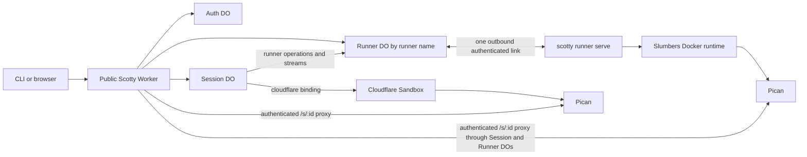
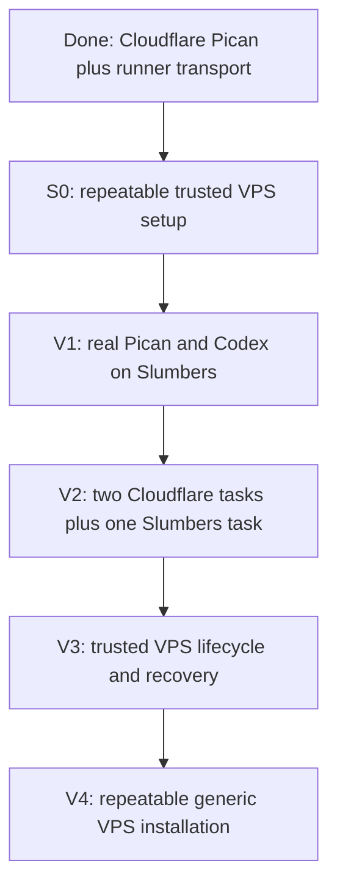

# Scotty portable execution — active plan

> **Current Cloudflare runtime override.** Cloudflare sessions now run Pi directly through the
> Sandbox native terminal proxy and bundled Ghostty Web. They do not run Pican, Sheppard, or tmux.
> Trusted runner sessions retain the Pican application and protocol described below. Any
> Cloudflare-specific Pican requirement in this document is historical; the Session DO authority,
> immutable provider binding, credential isolation, checkpoint, hard-cap, and runner contracts
> remain binding.

This is the governing plan for portable execution after commit
`d821a7381124e4ae2ef7f2734426a1b48627282b` on 2026-07-28. It records what is
implemented, the v1 scope selected after the Cloudflare and Slumbers deployment, and the
vertical slices that finish Cloudflare plus trusted VPS execution.

This file supersedes the portable-execution delivery section in `IMPLEMENTATION_DAG.md`.
`PLAN.md`, `IMPLEMENTATION_DAG.md`, and `EFFECT_V4_MIGRATION.md` still govern their existing
state-authority, lifecycle, Effect, Alchemy, and deployment invariants. This file overrides their
credential-isolation rule only for explicitly configured trusted VPS runners, as defined below.

Scotty is a new product. The remaining portability work may hard-cut internal schemas and routes.
Do not add compatibility branches for unused pre-portability records, legacy PTYs, Sheppard, or
old provider names.

## Outcome

One session is one durable task. The user chooses where it starts, then always works through the
same Scotty URL. Cloudflare opens the Pi terminal; a trusted runner opens its mounted Pican
application:

```sh
scotty beam up "PROMPT" --repo owner/repo --provider cloudflare
scotty beam up "PROMPT" --repo owner/repo --provider runner --runner slumbers
```

The prompt remains a normal CLI argument and JSON request field. A prompt file is not required.

The session ID, repository, branch, agent state, transcript, and lifecycle remain stable while
provider resource IDs and process IDs stay internal. A session never silently falls back to
another provider and does not migrate between providers in this plan.

## Requirements

| ID  | Requirement                                                                                                                                                                                                                               | Status    |
| --- | ----------------------------------------------------------------------------------------------------------------------------------------------------------------------------------------------------------------------------------------- | --------- |
| R0  | A user can create, open, steer, stop, resume, and destroy the same kind of Scotty session on Cloudflare or a named trusted VPS runner.                                                                                                    | Core goal |
| R1  | Cloudflare uses Pi through Ghostty Web and the Sandbox native terminal proxy. Trusted runners retain Pican. Neither path adds tmux or Sheppard.                                                                                           | Must-have |
| R2  | The session Durable Object remains authoritative for session identity, lifecycle, operation leases, execution binding, credential policy, Cloudflare credentials, and committed checkpoints.                                              | Must-have |
| R3  | Provider selection is explicit and immutable per session; an unavailable provider fails visibly without automatic fallback.                                                                                                               | Must-have |
| R4  | Cloudflare keeps sentinel-only workload credentials. A trusted VPS session may read owner Codex and Git credential files, but credentials never enter prompts, URLs, process arguments, logs, KV, R2, API responses, or Cloudflare state. | Must-have |
| R5  | Desired provider/runner state, observed connection state, runtime state, and displayed UI state are distinct and have one owner each.                                                                                                     | Must-have |
| R6  | Slumbers and manually managed Linux/VPS machines share one outbound runner path with per-session Docker workspace and process isolation.                                                                                                  | Must-have |
| R7  | A runner host and its session containers are inside the owner trust boundary; Docker isolation does not claim to hide owner credentials from the session workload.                                                                        | Must-have |
| R8  | Every delivery step is a small, demoable vertical slice with local, live failure, lifecycle, and cleanup proof.                                                                                                                           | Must-have |

## Locked language

| Term              | Meaning                                                                                       | Do not call it                      |
| ----------------- | --------------------------------------------------------------------------------------------- | ----------------------------------- |
| Session           | Durable user task with one workspace, lifecycle, agent state, and immutable provider binding. | sandbox, box, environment           |
| Provider          | A compute implementation selected at session creation: `cloudflare` or `runner`.              | location, execution target, backend |
| Runner            | The Scotty service running on a user-controlled Linux machine. `slumbers` is a runner name.   | host daemon, machine enrollment     |
| Connection        | A client’s authenticated attachment to the selected session runtime.                          | provider, runner                    |
| Control plane     | The public Worker plus the authoritative Auth, Session, and Runner Durable Objects.           | host, provider                      |
| Runtime           | The provider resource containing the workspace, agent, model-provider, and Git processes.     | control plane                       |
| Execution binding | The immutable provider-specific identity stored on a session.                                 | location field                      |

There is no `scotty-host` executable and no Beam Durable Object. The executable is `scotty`; the
machine command is `scotty runner serve`; the Durable Objects are named for what they own:
`ScottySandbox`, `ScottyAuthRegistry`, and `ScottyRunner`.

## What is implemented

### D0 — Cloudflare session product

The original product already supplied:

- one authoritative Session Durable Object per session;
- Auth Durable Object ownership, pairing, transfer, revocation, and recovery;
- KV as a non-secret session-list projection;
- R2 current/previous immutable checkpoint generations;
- session-bound Codex and GitHub sentinels with real credentials held by Worker secrets and
  session Durable Object storage;
- default-deny Cloudflare Sandbox egress with real credential substitution only at allowed
  upstreams;
- create, snapshot, hard-cap sleep, resume, beam down, and vaporize;
- guarded Alchemy production deployment plus fake and deployed E2E harnesses.

### D1 — Pi-hosted Cloudflare vertical

The shipped Cloudflare path now:

1. prepares `/workspace/<session-id>`;
2. seeds sentinel-only Pi auth, settings, skills, packages, and initial prompt under `.pi-agent`;
3. publishes `warm` when the workspace and Pi configuration are ready;
4. serves bundled Ghostty Web at the authenticated `/s/<session-id>` page;
5. authenticates and same-origin checks the terminal WebSocket;
6. launches `/usr/local/bin/scotty-pi-shell` through the Sandbox native terminal proxy;
7. consumes the initial prompt once, then uses `pi --continue` for later terminal sessions;
8. terminates the named Pi terminal session and runs `sync` before checkpoint or stop;
9. restores the same workspace and Pi state on resume;
10. lists only warm sessions in the terminal switcher and sends non-warm links back to Home.

There is no Cloudflare Pican, Sheppard, or tmux fallback. The embedded Linux Pican binary remains
pinned for the trusted runner compatibility path and is verified by
`worker/container/pican-linux-amd64.lock.json`.

### D2 — Portable runner command protocol

Commit `cf09a5798dc9ba09abe5b08356b3eed0012dfba6` added
`scotty runner serve`.

The current typed protocol supports:

- `EnsureRuntime`;
- `InspectRuntime`;
- one-shot `ExecRuntime` with argv rather than shell text;
- `StopRuntime`;
- `RemoveRuntime`;
- stable session-to-workspace/resource identity;
- same-session serialization and cross-session concurrency;
- bounded output;
- exact child-environment allowlisting;
- workspace-relative, symlink-aware cwd containment;
- operation IDs and durable runner receipts.

### D3 — Slumbers control-plane connection

Commit `ad827cc252a4d28e782daac305d450b1f51325c6` added:

- a private, URL-disabled Cloudflare Worker containing `ScottyRunner`;
- an authenticated outbound WebSocket from `scotty runner serve`;
- a Docker execution implementation with digest-pinned images, no Docker socket in the workload,
  no host networking, dropped Linux capabilities, resource limits, and bind-mounted
  session workspace;
- a durable operation journal with ambiguous-exec recovery fencing;
- the first status display in the sessions page.

The extra private Worker is a Cloudflare deployment boundary for the Runner Durable Object. It is
not another control plane or a user-visible provider. The public Worker still owns authentication
and routes; it reaches the Runner Durable Object through the `RUNNERS` service binding.

### D4 — Honest runner liveness and forward-only browser auth

Commits `b9bb1ae92a4d80a4234d2d92c2c856ce51cae21d` and
`9499e4d649c559e3dc50a85709a240471e822b99` added:

- a correlated one-second Runner probe/ack rather than treating an attached socket as healthy;
- socket closure on send failure, probe timeout, protocol mismatch, or replacement;
- a forward-only Auth authority reset without legacy migration branches;
- clean owner recovery on the new authority.

Production and Slumbers were then deployed from exact commit `9499e4d`. Slumbers runs the current
Linux binary as an enabled user systemd service with Docker isolation. The live sessions page
proved `Cloudflare available` and `Slumbers connected`.

That proof means only that Cloudflare was deployed and the Slumbers control link answered a live
probe. It does **not** mean a Scotty session can run on Slumbers.

## Current gaps

1. The real runner create path and repeatable setup command pass local gates. Slumbers now runs
   the generated service with the pinned real image, but the matching Worker change and real
   Pican/Codex session have not completed the deployed gate.
2. A refreshed Codex credential stays with its current trusted VPS session. Propagating a rotated
   credential to a later or concurrent VPS session remains recovery work.
3. Runner stop, resume, checkpoint, hard-cap, host-reboot recovery, and orphan cleanup are not
   connected to the public session lifecycle.
4. The setup command is reusable, but a clean second VPS install and image release procedure have
   not passed a live proof.
5. The latest deployed Cloudflare code path is ready, but the final simultaneous real-task proof
   has not run after the latest deployment.
6. Local Pican cannot yet save a Scotty remote connection and load its remote sessions. The
   mounted browser Pican is the v1 interaction path.

## A: Cloudflare authority with Pican on Cloudflare and trusted VPS runners



The control plane owns the logical session. Providers supply compute. Pican owns the agent-facing
application and native agent protocol. The runner is a transport and isolation executor, not a
second scheduler.

### Fit check: R × A

| Req | Requirement                                                                                                                                                                                                                               | Status    |  A  |
| --- | ----------------------------------------------------------------------------------------------------------------------------------------------------------------------------------------------------------------------------------------- | --------- | :-: |
| R0  | A user can create, open, steer, stop, resume, and destroy the same kind of Scotty session on Cloudflare or a named trusted VPS runner.                                                                                                    | Core goal | ✅  |
| R1  | Pican is the only session UI and agent host; Scotty does not rebuild a terminal or a second Codex app-server UI.                                                                                                                          | Must-have | ✅  |
| R2  | The session Durable Object remains authoritative for session identity, lifecycle, operation leases, execution binding, credential policy, Cloudflare credentials, and committed checkpoints.                                              | Must-have | ✅  |
| R3  | Provider selection is explicit and immutable per session; an unavailable provider fails visibly without automatic fallback.                                                                                                               | Must-have | ✅  |
| R4  | Cloudflare keeps sentinel-only workload credentials. A trusted VPS session may read owner Codex and Git credential files, but credentials never enter prompts, URLs, process arguments, logs, KV, R2, API responses, or Cloudflare state. | Must-have | ✅  |
| R5  | Desired provider/runner state, observed connection state, runtime state, and displayed UI state are distinct and have one owner each.                                                                                                     | Must-have | ✅  |
| R6  | Slumbers and manually managed Linux/VPS machines share one outbound runner path with per-session Docker workspace and process isolation.                                                                                                  | Must-have | ✅  |
| R7  | A runner host and its session containers are inside the owner trust boundary; Docker isolation does not claim to hide owner credentials from the session workload.                                                                        | Must-have | ✅  |
| R8  | Every delivery step is a small, demoable vertical slice with local, live failure, lifecycle, and cleanup proof.                                                                                                                           | Must-have | ✅  |

### Execution intent and binding

The Session Durable Object must record intent before the first external side effect. Hard-cut
`SessionRecord` to a new schema version when the runner session slice lands:

```ts
type Execution =
  | {
      readonly state: "provisioning";
      readonly provider: "cloudflare";
      readonly sandboxId: string;
    }
  | {
      readonly state: "provisioning";
      readonly provider: "runner";
      readonly runner: string;
      readonly runtimeId: string;
    }
  | {
      readonly state: "bound";
      readonly provider: "cloudflare";
      readonly sandboxId: string;
    }
  | {
      readonly state: "bound";
      readonly provider: "runner";
      readonly runner: string;
      readonly runtimeId: string;
    };
```

The provisioning case is persisted with the operation lease before calling a provider. The bound
case is committed as soon as provider identity is known. The union is decoded at the storage
boundary. Do not use a stringly typed `location`, generic provider JSON bag, or optional fields
that allow impossible combinations.

The provider choice is written once and never changes. A bound provider resource identity is also
immutable unless its exact provider case defines a generation change during recovery. This plan
does not support moving a session between providers.

### Small capability seams

Do not create a giant provider SDK or a generic `Runner` interface before the second real
implementation needs it. Keep these product capabilities explicit and extract their shared
Effect services one vertical at a time:

1. **Resource control** — provision/ensure, inspect, stop, resume, remove.
2. **Command execution** — argv, cwd, explicit environment, timeout, cancellation, bounded result.
3. **Mounted application stream** — authenticated HTTP request/response streaming for Pican,
   including SSE, disconnect cancellation, and bounded backpressure.
4. **Checkpoint stream** — quiesce Pican, export/import the workspace, then let the Session DO
   commit current/previous R2 generations.
5. **Credential delivery** — keep the Cloudflare sentinel path unchanged; on a trusted VPS, copy
   only the configured owner Codex and Git credential files into one session area outside the
   workspace, then mount that area into its runtime.

Git cloning, branch naming, credential-helper setup, Pican launch, Codex launch, Pican identity,
hard-cap policy, checkpoint-generation selection, and cleanup order are Scotty behavior. They do
not belong in provider adapters.

PTY is not a portability primitive in this plan. Pican’s HTTP/API/SSE application is the supported
interaction surface. A future terminal is a Pican feature or an independently authorized rescue
surface, not a reason to restore the deleted terminal stack.

## Ownership

### Scotty control plane

Scotty owns:

- browser and CLI authentication;
- session IDs, repository, branch, prompt, provider selection, and Pican identity;
- session lifecycle, operation leases, hard-cap schedules, and failure recovery;
- runner desired state and runner credential authority;
- Cloudflare Codex/GitHub credentials and sentinel redemption;
- the trusted VPS credential-file policy and session-scoped mount configuration;
- current/previous R2 checkpoint selection;
- the public `/s/<id>` route and all browser credential stripping;
- provider resource IDs and orphan reconciliation;
- the session list and provider/runner status read model.

### Pican

Pican owns:

- the Codex app-server process and protocol;
- the session transcript, projections, tasks, files, Git views, steering, and cancellation UI;
- runtime/native-session mapping inside the workspace;
- strict workspace/state-root containment;
- filtering child environments so Scotty’s Pican proxy credential never reaches Codex.

Scotty owns Pican’s process lifecycle around provider stop/checkpoint. Until Pican exposes a richer
quiesce contract, Scotty uses the proven `SIGTERM → bounded wait → sync → checkpoint` sequence.

### Provider

A provider owns only:

- resource creation and provider identity;
- low-level readiness and lifecycle calls it can guarantee;
- low-level command/file/stream transport;
- provider-specific timeout, death detection, and unsupported-capability failures;
- provider-native snapshots as a recovery accelerator;
- host-level isolation and network enforcement.

Provider status, snapshots, or heartbeats never override the authoritative Session record or R2
checkpoint decision.

### Provider-specific behavior

- **Cloudflare:** the Session Durable Object talks to its Sandbox directly. Cloudflare’s Container
  and backup primitives remain adapter details; Alchemy remains the only deployment owner.
- **Runner:** Slumbers or a manually managed Linux/VPS host runs one `scotty runner serve` systemd
  service and one isolated Docker runtime per session. Scotty can stop/remove session containers,
  but it does not power off the physical host.
- **Future Box, E2B, Daytona, exe.dev, Modal, or managed Hetzner:** add one concrete resource adapter,
  then use the same mounted-app/checkpoint contract where the provider can run the Scotty runner.
  Do not expand the common contract for speculative provider features.

A manually managed Hetzner VPS is a named `runner`, like Slumbers. A future Scotty-owned Hetzner
provisioner would be a separate provider.

## Runner connection and disconnection

The current UI flattens two different facts:

- `Cloudflare available` is a hardcoded configuration claim.
- `Slumbers connected` is an active liveness observation.

Replace that with explicit desired and observed state.

### State

```ts
type RunnerDesiredState = "accepting" | "draining" | "disabled";
type RunnerConnectionState = "connected" | "disconnected";

type RunnerStatus = {
  readonly name: string;
  readonly desired: RunnerDesiredState;
  readonly connection: RunnerConnectionState;
  readonly lastSeenAt: string | null;
  readonly assignedSessions: number;
};
```

The named Runner Durable Object owns `desired`, active socket identity, last successful probe
metadata, and in-flight operation correlations. `connection` is freshly derived by active probe.
`assignedSessions` is a projection; each Session Durable Object remains authoritative for its own
binding. The sessions page only renders the control-plane response.

### Commands

- `enable` sets `accepting`; new sessions may be placed.
- `drain` refuses new sessions but keeps the control link and existing sessions working.
- `disable` refuses new work and ordinary runtime commands while retaining enough control to
  inspect, stop, or remove existing runtimes.
- `disconnect` closes the current transport from the Worker. It is an operator diagnostic, not a
  durable desired state. If still enabled, the runner supervisor reconnects with bounded
  exponential backoff.
- `revoke` invalidates the runner credential and closes the socket. Returning requires a new
  credential to be installed on the machine.

Do not model “turn off Slumbers” as disconnect. The Worker cannot reconnect a powered-off machine.
The runner systemd service owns local process restart; the runner link owns network reconnect; the
Runner Durable Object owns admission and transport liveness.

### API and UI naming

Use the same nouns everywhere:

- `GET /api/providers` and a `/providers` UI;
- `GET /api/runners` and runner rows on `/providers`;
- `POST /api/runners/:name/enable`;
- `POST /api/runners/:name/drain`;
- `POST /api/runners/:name/disable`;
- `POST /api/runners/:name/disconnect`;
- `provider` and optional `runner` fields in session creation.

Remove `/api/status` after these reads land. Do not add `locations`,
`execution-targets`, `machine enrollments`, or `/settings/compute`.

For the first Slumbers slice, its name and token may stay explicit operator configuration. Before
adding a second self-hosted runner, add owner-only `scotty runners add|rotate|revoke|list` and
`POST /api/runners` with a one-time returned token. Call it adding a runner, not enrollment.

### Provider status

Provider status is not a socket status:

- Cloudflare may report `configured`; a real create/inspect operation proves session readiness.
- Runner provider readiness requires at least one `accepting + connected` runner.
  The session card separately shows task/session status and runtime health. A disconnected runner
  does not mutate a warm session to failed until a session operation or bounded recovery policy
  establishes the failure.

## Secrets and capabilities

### Cloudflare

Worker secrets remain inherited bindings outside Alchemy state:

- `SCOTTY_TOKEN`;
- `CODEX_AUTH_JSON`;
- `GH_TOKEN`;
- current static Slumbers runner credential until runner-token management lands;

`npm run deploy:production` remains the only Cloudflare deployment path and must preserve inherited
secrets rather than serializing their values into Alchemy state.

### Slumbers and other self-hosted runners

The root/user systemd environment contains:

- Scotty control-plane URL;
- stable runner name;
- runner credential;
- runner workspace root and digest-pinned runtime image configuration.

The runner credential never enters a session container. Session containers receive only
Pican’s internal proxy credential plus the configured owner Codex and Git credential files. The
host copies those files into only the owning session area and mounts that area into the runtime.
It never copies them into the workspace or a checkpoint.

This trusted-runner rule is a deliberate v1 security contract change. The owner trusts the VPS
host and the code that runs inside its session containers with these credentials. Docker provides
workspace and process separation. It does not provide credential secrecy from the workload.

The v1 runner does not add a credential broker, sidecar, default-deny egress proxy, or sentinel
redemption path.

### Pican proxy credential

The Pican proxy token exists because Pican is private and must reject direct callers. It is:

- generated and owned per Scotty session;
- passed to Pican through `PICAN_PROXY_TOKEN`, never a CLI argument;
- injected by Scotty only on the private Pican hop;
- stripped from Codex children by Pican;
- never accepted from or returned to the browser.

## Session and runtime lifecycle

Keep the public session states small:

```text
booting → warm → sleeping
    ↘       ↘       ↘
      failed        gone
```

Transient actions remain in the persisted operation lease rather than expanding session status.

### Create

1. The Session Durable Object validates and persists the immutable execution binding.
2. The selected provider provisions or ensures its resource.
3. Scotty prepares the repository and `scotty/<id>` branch in the isolated workspace.
4. Scotty installs Cloudflare sentinels or mounts the configured trusted VPS credential files.
5. Scotty starts Pican at the fixed workspace/state roots.
6. Scotty waits for mounted-app readiness.
7. Scotty idempotently creates the Pican hosted session with the outer Scotty session ID.
8. The Session Durable Object persists the native Pican/Codex identity and publishes `warm`.

### Snapshot or sleep

1. Stop admission of new Pican work.
2. Send Pican `SIGTERM` and wait within the hard bound.
3. Use the staged kill fallback only if the graceful wait expires.
4. Run `sync`.
5. Export the workspace checkpoint to R2.
6. Commit it as `current`; retain the prior `current` as `previous`.
7. For an on-demand snapshot, restart Pican, prove readiness, and remain `warm`.
8. For idle sleep or hard cap, stop the provider runtime and publish `sleeping` only after the
   checkpoint commit.

Provider-native snapshots may happen too, but do not replace step 5.

### Resume

1. Resume or recreate the provider resource allowed by the same execution-binding case.
2. Restore the committed R2 checkpoint if the provider workspace is missing or suspect.
3. Restart the runner/systemd service where applicable.
4. Start Pican with the same state and workspace roots.
5. Verify Pican readiness and stable session identity.
6. Publish `warm`.

### Vaporize

1. Stop new work for the session.
2. Stop Pican and the provider runtime.
3. Remove the runner runtime and its workspace.
4. Delete every owned R2 checkpoint generation.
5. Delete the DO credential bundle and KV projection.
6. Persist only the minimal `gone` tombstone.
7. Reconcile and report any provider resource the API could not remove.

## Delivery DAG



Finish one slice and its live proof before starting the next slice. Box, Daytona, and other
managed providers do not change this v1 contract.

## Next vertical slices

### S0 — Repeatable trusted VPS setup

**User-visible result:** one normal command installs or updates the runner on Slumbers before any
session starts.

Implement:

- `scotty runner setup` validates Docker, the digest-pinned image, the Codex auth source, the
  current GitHub CLI login, and `SCOTTY_RUNNER_TOKEN`;
- install the compiled runner, runner-only credential sources, secure environment file, and
  hardened systemd user service;
- reload, enable, restart, and verify the service without printing a token.

Proof:

- run the command on Slumbers instead of editing the service by hand;
- run it a second time and prove the same service becomes active;
- confirm the service uses the installed binary, image digest, and runner-only credential paths.

### V1 — Real Pican and Codex on Slumbers

**User-visible result:** create one Slumbers session, open Pican, watch Codex run the initial
prompt in a private repository, and vaporize the session.

Implement:

- replace the Python fixture process with the pinned Pican and Codex runtime already present in
  the portable image;
- add explicit trusted-host paths for the owner Codex auth file and GitHub CLI config;
- copy those files into the session area, mount that area outside the workspace, and keep the
  runner credential out of the container;
- prepare the repository and branch, start Pican, wait for readiness, create the hosted session
  with the outer session ID, and publish `warm` only after Pican accepts the initial prompt;
- stop Pican and remove the runtime plus workspace during vaporize.

Proof:

- the mounted Pican assets, API, POST body, and SSE stream work through the existing runner link;
- the session clones one allowed private repository and Codex completes one real task;
- credential files are absent from the workspace, Docker inspect output, logs, API responses, KV,
  and R2;
- vaporize removes the Docker container and session workspace;
- the Cloudflare path remains unchanged.

### V2 — Parallel Cloudflare and Slumbers proof

**User-visible result:** two Cloudflare sessions and one Slumbers session run at the same time and
remain available after the browser disconnects.

Implement:

- add no new provider abstraction;
- fix only defects found by the three-session proof;
- keep every final inspection session alive until the user confirms inspection is complete.

Proof:

- all three tasks run different prompts;
- each mounted Pican session opens in Helium;
- browser disconnect and reconnect do not stop work;
- one provider failure does not block the other sessions.

### V3 — Trusted VPS lifecycle and recovery

**User-visible result:** a Slumbers session stops, resumes, and recovers after runner or host
restart with the same workspace and Pican identity.

Implement:

- checkpoint export/import streaming through the runner;
- Pican graceful stop, sync, R2 current/previous commit, Docker stop/remove;
- restore after runner process restart and Slumbers host reboot;
- hard-cap behavior and orphan reconciliation;
- provider-specific diagnostics without provider-specific public session commands.

Proof:

- stop and resume one Slumbers session twice;
- restart `scotty-runner.service`;
- reboot Slumbers and verify the exact repository marker plus Pican identity;
- inject failed checkpoint, process kill, host reboot, stale operation receipt, and cleanup retry;
- vaporize and scan runtime, KV, R2, schedule, Docker, and branch orphans.

### V4 — Generic VPS portability proof

**User-visible result:** install the same runner on another Linux VPS without changing Scotty code.

Implement:

- reuse the S0 command, versioned Linux runner binary, and digest-pinned runtime image;
- add one documented health check and upgrade procedure;
- no automatic host provisioning, fleet scheduler, or provider-specific VPS API.

Proof:

- install on a clean supported Linux host;
- connect it as a new named runner;
- repeat the V1 create, work, mounted Pican, and vaporize proof.

## Test strategy

### Local gate on every slice

```sh
npm run fmt
npm run lint:skills
npm run lint
npm run typecheck
npm run test:all
node e2e/scripts/scan.mjs
bun build cli/scotty.ts --compile --outfile /tmp/scotty-cli
git diff --check
```

Add focused `@effect/vitest` tests for migrated Effect programs and use the pinned Effect v4 source
before introducing a new pattern.

### Contract gate

Every concrete adapter passes the same behavior cases that it claims:

- ensure is idempotent;
- inspect is truthful;
- exec distinguishes nonzero exit, timeout, cancellation, transport death, and unknown outcome;
- stop preserves workspace;
- remove deletes only the owning session;
- mounted HTTP preserves status/allowed headers/body/SSE and cancels on disconnect;
- checkpoint export/import is bounded, hashed, and traversal-safe;
- failures are typed and redact provider details.

Unsupported capabilities return a typed unsupported result. They do not fake success.

### Live failure matrix

Run these against Slumbers before declaring the trusted VPS path complete:

1. browser disconnect and reconnect during streamed output;
2. runner WebSocket drop before, during, and after an operation;
3. runner process kill and systemd restart;
4. session-container kill and provider-host reboot/stop-resume;
5. duplicate operation, reply loss, timeout, and ambiguous process death;
6. Pican graceful timeout and staged hard kill;
7. checkpoint upload failure and restore failure;
8. credential-file mount scope and checkpoint exclusion;
9. vaporize retry after every intermediate failure;
10. simultaneous Cloudflare plus external-provider work.

### Cloudflare proof

Keep two separate Cloudflare gates:

- the stage-isolated destructive canary proves create, mounted Pican, SSE, credentials, snapshot,
  hard cap, resume, beam down, and vaporize;
- guarded `npm run deploy:production` proves exact clean `main`, account/resource audit, Alchemy
  rollout/no-op, and post-deploy health.

Adding runner code must not make an unchanged Cloudflare Container rebuild necessary unless
the pinned runtime image changed. Separate runtime artifacts from Worker-only changes where
Alchemy’s source hash currently couples them.

### Slumbers proof

Deploy the exact compiled Linux binary and digest-pinned portable image, verify hashes, restart
the enabled systemd unit, and prove control-plane liveness. Then run the V1–V3 API/UI sequence
through production Scotty. SSH/systemctl is setup and failure injection only; normal session
operations must come from Scotty.

## Deployment and operations

### Cloudflare deploy

`npm run deploy:production` continues to deploy:

- the public Worker;
- Auth, Session, and Runner Durable Objects;
- the private Runner Worker/service binding;
- the Cloudflare Sandbox Container application;
- KV, R2, assets, and migrations.

It does not SSH into Slumbers or update another VPS.

### Runner release

Produce one versioned/digest-verified Linux `scotty` binary and one digest-pinned portable runtime
image. Slumbers and manually managed VPS runners update through an explicit operator command or
service-management workflow. The runner reports its protocol/build version during hello; the
control plane rejects incompatible versions.

## Deliberately deferred

- automatic provider selection, fallback, or migration;
- session movement between machines;
- fleets, queues, pools, autoscaling, pricing, and usage billing;
- generic Git, PTY, desktop, or provider-snapshot APIs;
- Box, Daytona, E2B, exe.dev, Modal, and managed VPS provisioning;
- a second lightweight Codex UI;
- periodic Pican application heartbeats; create and access use bounded readiness checks instead;
- restoring legacy terminal or Sheppard behavior;
- backward compatibility for unused pre-portability session schemas;
- provider features that cannot pass the common security and recovery gates.

## Source material

- `PLAN.md`
- `IMPLEMENTATION_DAG.md`
- `EFFECT_V4_MIGRATION.md`
- `docs/research/portable-execution-backends.md`
- `docs/research/flue-primitives-review.md`
- `docs/research/pican-remote-connections.md`
- `docs/research/amp-orbs-product-patterns.md`
