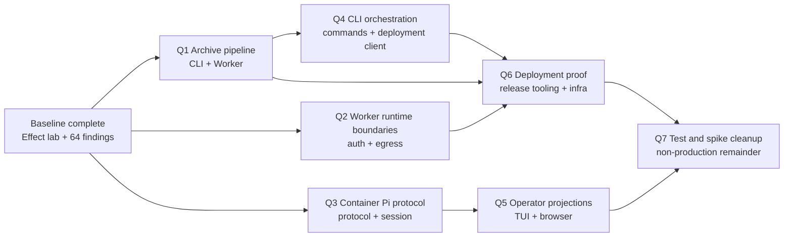

# Quality cleanup — execution DAG

## Goal

Reduce the remaining Oxlint complexity findings in small, behavior-preserving slices. Each ticket is
completed in a fresh session, proves the same real path before and after the move, commits one
coherent change, and stops. Complexity 20 is the gate; roughly 500 lines remains a cohesion signal,
not a hard limit.

Current baseline: commit `14baadf5`, 64 complexity findings, and zero findings in the local lab.
Recount at the start of every ticket because earlier tickets may change the baseline.

## DAG



Parallel work is allowed only where the graph branches and the tickets do not edit shared files.
Default to one ticket per fresh session.

## Ticket boundaries

| Ticket | Outcome                                                                                                              | Primary files                                                                                   | Depends on |
| ------ | -------------------------------------------------------------------------------------------------------------------- | ----------------------------------------------------------------------------------------------- | ---------- |
| Q1     | One clear archive validation/building pipeline across CLI and Worker without changing archive bytes or public errors | `cli/src/{archive,sandbox-archive,sandbox-walk}.ts`, `worker/src/sandbox-archive.ts`            | Baseline   |
| Q2     | Smaller Worker authentication and egress decision seams while preserving authority and credential isolation          | `worker/src/{auth-registry,container-session-egress,egress}.ts`                                 | Baseline   |
| Q3     | Separate Pi wire decoding, session transition, and host I/O in the container without changing protocol records       | `worker/container/scotty-pi-{protocol,session}.mjs`                                             | Baseline   |
| Q4     | Decompose CLI command and installation orchestration around existing services and public JSON/exit contracts         | `cli/src/{commands,dependencies,installation-deployment,runner-operation-journal,transport}.ts` | Q1         |
| Q5     | Make TUI and browser projections explicit consumers of the stabilized protocol; preserve rendered behavior           | `tui/src/**`, affected `worker/public/*.js` projection/view modules                             | Q3         |
| Q6     | Simplify production deployment planning and settlement proof without changing deployment authority                   | `scripts/deploy-production.mjs`, `infra/installation.ts`, `scripts/check-pi-packages.mjs`       | Q1, Q2, Q4 |
| Q7     | Remove remaining complexity in tests, fixtures, and research spikes after production seams settle                    | affected `worker/test/**`, `cli/effect-test/**`, `desktop/fixtures/**`, `spikes/infra/**`       | Q5, Q6     |

A ticket may finish with more than one commit only when a mechanical move must be proven separately
from a behavior-preserving simplification. It must still end in the same session and stop.

## Required contents of each detailed ticket

Every ticket plan written after discussion must contain only the information needed to execute it:

1. **Orientation** — the current problem, desired seam, and why this boundary is cohesive.
2. **Starting proof** — clean starting commit, current diagnostics, focused tests, and the exact lab
   flow to run before editing.
3. **Contracts to preserve** — public shapes, state owner, credential boundary, or protocol involved.
4. **Files and symbols** — the concrete starting locations; the executor rechecks them against live
   code before editing.
5. **Three or fewer implementation chunks** — each with behavior, files, dependency, and completion
   check.
6. **After proof** — the same lab operation, focused tests, typecheck, Knip, changed-file Oxlint,
   full tests, and complexity recount.
7. **Completion** — expected diagnostic reduction, commit, clean worktree, concise handoff, and stop.

Do not invent speculative failure paths or redesign adjacent systems. Add a characterization only
for a real contract touched by the move. If the before/after lab results diverge, stop at the first
difference rather than updating expectations.

## Shared execution protocol

```text
fresh session
  read AGENTS.md + ticket
  verify clean main and recount findings
  run baseline lab flow
  run focused characterization
  make one cohesive move
  run focused checks
  run the same lab flow again
  run full verification + recount
  commit
  write handoff
  stop
```

The default lab flow is `start -> doctor --json -> stop`. A ticket that changes a Session, Sandbox,
protocol, or deployment path must name one additional representative operation that exercises that
path. `doctor` alone is not Sandbox proof. Deployment remains separately authorized and is never
implied by a passing local lab.
