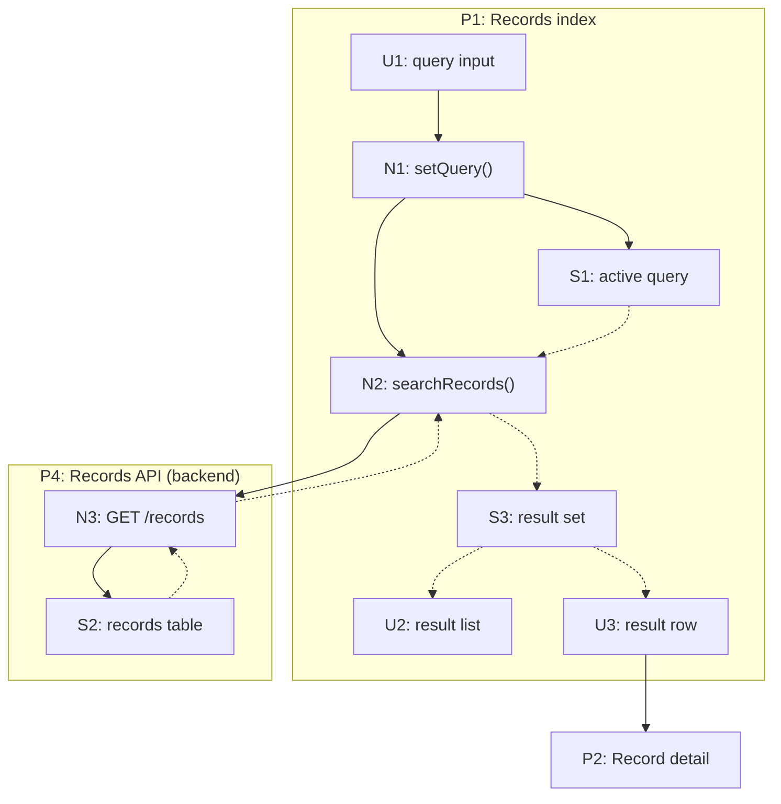

# Breadboard Visualization

Use Mermaid as a projection of completed tables. Correct the tables first, then regenerate the diagram.

## Encoding



- Solid arrows (`-->`) render Wires Out.
- Dashed arrows (`-.->`) render Returns To.
- Detailed Places use subgraphs whose IDs match their `P` identifiers. A destination Place with no in-scope internals may be a single boundary node with the same ID.
- Nest subplace subgraphs inside their parent Place.
- Label omitted intermediate flow with `...`; the tables still retain the evidence needed to justify that abbreviation.

## Styles

```mermaid
classDef ui fill:#f8c8dc,stroke:#a64d79,color:#111
classDef code fill:#dce3ea,stroke:#596773,color:#111
classDef store fill:#ddd6fe,stroke:#6d5bd0,color:#111
classDef chunk fill:#c9edf2,stroke:#247b87,color:#111,stroke-width:2px
classDef placeRef fill:#f8c8dc,stroke:#a64d79,stroke-dasharray:5 5,color:#111
```

Use stable colors across every view. A detached Place reference is a `U` node with a dashed border. A chunk is a single boundary node in the main diagram and has a separate internal view with the same entry and result wires.

## Workflow guides

For a dense board, precede the diagram with a short numbered trace table. Optional step-marker nodes may point to the corresponding affordance with dashed lines; they annotate the graph and never replace edges.

## Slice views

Render the complete board in a slice view and distinguish:

- current slice: bright emphasis;
- prior slices: solid neutral styling; and
- future slices: transparent or faint dashed styling.

Do not delete future rows or edges from the complete breadboard to simplify a slice diagram.
